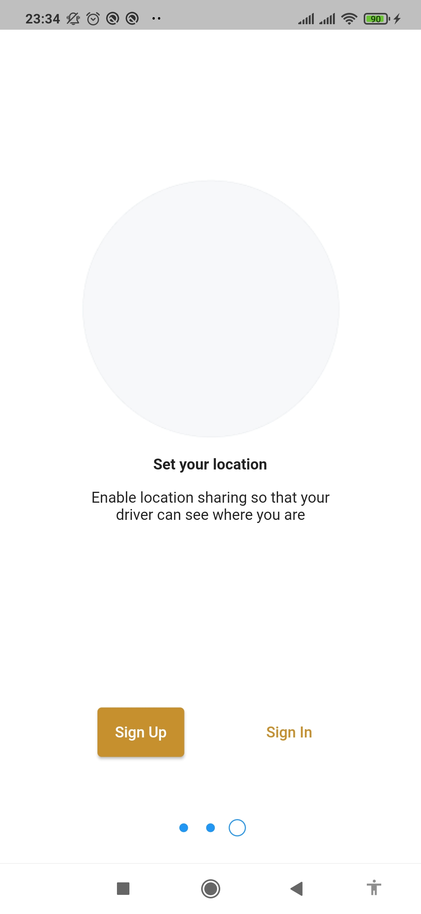
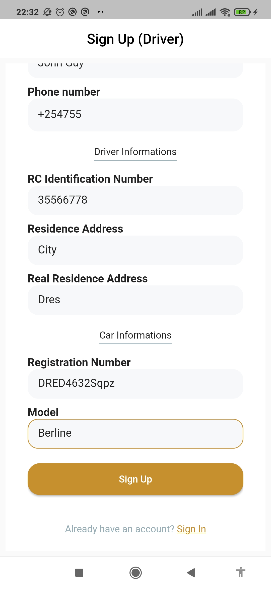
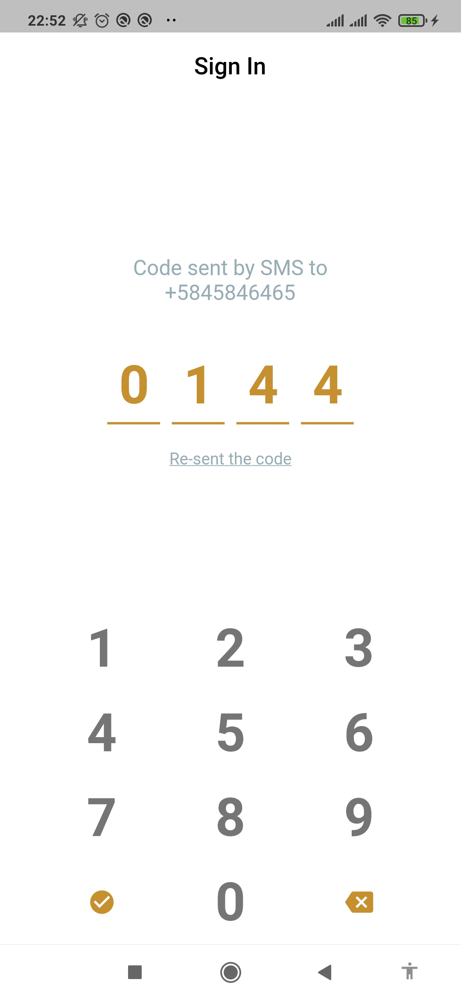

[My Portfolio](https://maelfosso.github.io)

# Andi Taxi (mobile)

> clone app of some Uber features





Additional description about the project and its features.

## Built With

- Flutter
- Dart

## Getting Started

Before running the mobile application, you need to setup the API endpoints. The endpoint is available by running [https://github.com/maelfosso/andi-taxi-api](https://github.com/maelfosso/andi-taxi-api)

Creates an `.env` file for adding the `**BASE_URL**` for the API

```.env
BASE_URL=http://x.x.x.x:3000/api
```

Add also your `**GOOGLE_MAPS_API_KEY**`
```.env
BASE_URL=
GOOGLE_MAPS_API_KEY=
```

Without any of these variables, the application will not start.

### Setup

After creating `.env` file

- `cd andi-taxi-mobile-app`
- `flutter pub get`
- `flutter run`

### Usage

- Creates an account as client or driver
- Sign in (keep the code displayed)
- Enter the code. You have one minute.

### Run tests


## Authors

- GitHub: [@maelfosso](https://github.com/maelfosso)
- Twitter: [@maelfosso](https://twitter.com/maelfosso)
- LinkedIn: [LinkedIn](https://www.linkedin.com/in/mael-fosso-650b6346/)

## 📝 License

This project is [MIT](./MIT.md) licensed.