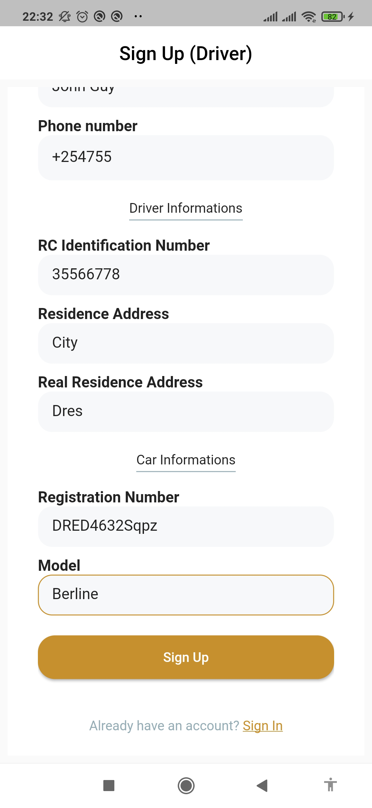
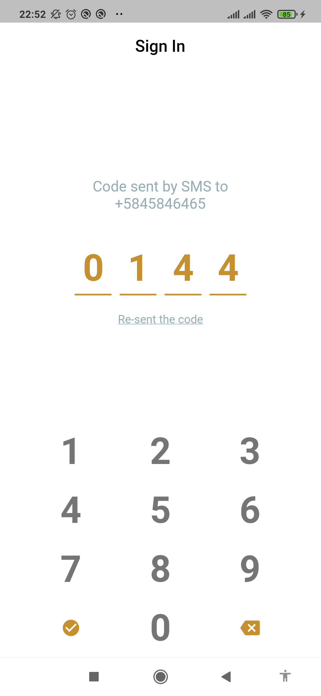

[My Portfolio](https://maelfosso.github.io)

# Andi Taxi (mobile)

> clone app of some Uber features

## Built With

- Flutter
- Dart

## Requirements

To run this application, you must have installed

- Flutter
- Docker
- Docker compose

`docker` and `docker-compose` are necessary for the backend available at [https://github.com/maelfosso/andi-taxi-api](https://github.com/maelfosso/andi-taxi-api)

## Setup

Follow these steps to launch the application

### **Step 1**: Run the backend

The backend is available at `https://github.com/maelfosso/andi-taxi-api`. Follow the steps indicated there to run it.


### **Step 2**: Get the IP address of the computer running the backend

You can use `ifconfig` or `ip addr show` to get your IP address

### **Step 3**: Clone the repository 

`git clone https://github.com/maelfosso/andi-taxi-api`

### **Step**: Change the directory 

`cd andi-taxi-api`

### **Step 4**: Create an `.env` file in the root directory of the project

`touch .env`

### **Step 5**: Add variables into the `.env` file

The application depends on

- The backend, so we need the IP address of the host running this one. Remember you wrote it down at **Step 2**. You refer to it in the `env` file with the `BASE_URL` variable.

- Google Maps, so we need your Google maps API Key. You refer to it into the `env` file through the `GOOGLE_MAPS_API_KEY` variable.

At the end, your `.env` file will look like this
```.env
BASE_URL=http://x.x.x.x:3000/api
GOOGLE_MAPS_API_KEY=
```

### **Step 6**: Run the application

`flutter run`


## Usage

- Creates an account as client or driver
- Sign in (keep the code displayed)
- Enter the code. You have one minute.


## Run tests


## Authors

- GitHub: [@maelfosso](https://github.com/maelfosso)
- Twitter: [@maelfosso](https://twitter.com/maelfosso)
- LinkedIn: [LinkedIn](https://www.linkedin.com/in/mael-fosso-650b6346/)

## 📝 License

This project is [MIT](./MIT.md) licensed.

## Screenshots




